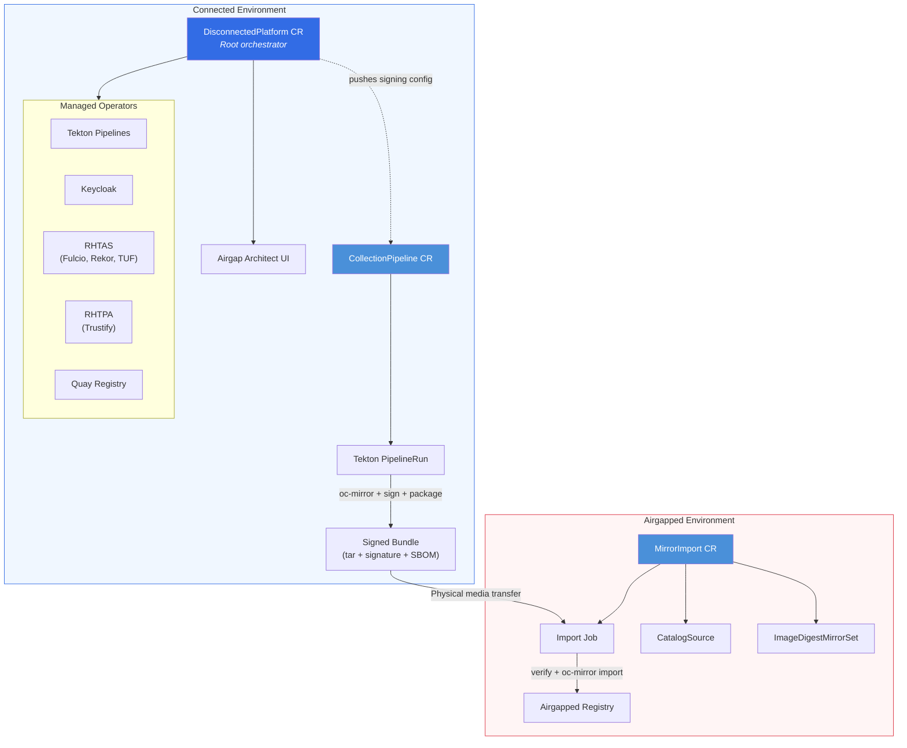

# mirror-operator

A Kubernetes operator that automates the full lifecycle of disconnected (airgapped) OpenShift environments. It handles content collection from internet sources, supply chain signing via [Red Hat Trusted Artifact Signer](https://docs.redhat.com/en/documentation/red_hat_trusted_artifact_signer), physical transfer packaging, and import into airgapped registries -- replacing manual `oc-mirror` workflows with declarative, Kubernetes-native automation.

This operator is an implementation of the [OCP Disconnected Pipeline reference architecture](https://github.com/mathianasj/ocp-disco-pipeline-arch) and consumes ImageSetConfiguration YAML generated by [Airgap Architect](https://github.com/bstrauss84/openshift-airgap-architect.git).

## Architecture Overview



## How It Works

**Connected side -- Collection.** A `DisconnectedPlatform` CR (mode: `connected`) installs the required operator ecosystem (Tekton, Keycloak, RHTAS, Quay) and deploys the Airgap Architect web UI. When a `CollectionPipeline` CR is created, the operator launches a Tekton PipelineRun that mirrors images from upstream registries using `oc-mirror`, signs them with Fulcio keyless certificates via RHTAS, generates an SBOM with Syft, and packages everything into a signed tar bundle uploaded to S3 storage.

**Physical transfer.** The bundle (tar archive, cosign signature, SBOM, and attestation document) is downloaded from the connected environment and transferred to the airgapped environment via physical media -- USB drive, DVD, or approved data transfer mechanism.

**Airgapped side -- Import.** A `MirrorImport` CR triggers an import Job that verifies the cosign signature and attestation hashes, then runs `oc-mirror` to import the bundle into the local registry. The operator can automatically create an OLM `CatalogSource` and `ImageDigestMirrorSet` so the cluster immediately sees the mirrored content.

**Status aggregation.** The `DisconnectedPlatform` controller aggregates collection and import history from all child resources, providing a centralized view of the entire mirror lifecycle.

## Custom Resources

| CRD | Scope | Description |
|-----|-------|-------------|
| **[DisconnectedPlatform](docs/crd-reference.md#disconnectedplatform)** | Cluster | Root orchestrator -- installs operators, deploys UI, manages signing infrastructure, aggregates history |
| **[CollectionPipeline](docs/crd-reference.md#collectionpipeline)** | Namespace | Triggers Tekton pipelines to collect, sign, and package images from internet sources |
| **[MirrorImport](docs/crd-reference.md#mirrorimport)** | Namespace | Imports and verifies bundles into airgapped registries, publishes CatalogSource and IDMS |
| **[ClusterBootstrap](docs/crd-reference.md#clusterbootstrap)** | Namespace | Provisions new OpenShift clusters from mirrored content *(planned)* |

## Managed Components

On the connected side, the operator installs and configures the following via OLM:

| Component | Purpose |
|-----------|---------|
| **Tekton Pipelines** | Executes collection pipeline tasks (oc-mirror, signing, packaging) |
| **Red Hat Build of Keycloak** | Provides OIDC identity for Fulcio keyless signing |
| **RHTAS** (Fulcio, Rekor, CTLog, TUF) | Private Sigstore deployment for supply chain signing and verification |
| **RHTPA** (Trustify) | SBOM storage and vulnerability analysis |
| **Quay** | Intermediate registry for the three-phase signing workflow |

Each operator can be individually disabled or customized. See the [Architecture Guide](docs/architecture.md) for details on how these components interact.

## Quick Start

### Prerequisites

- OpenShift 4.14+ cluster with cluster-admin access
- `oc` CLI installed and authenticated
- OLM (Operator Lifecycle Manager) available on the cluster

### Install the Operator

```sh
# Install CRDs
make install

# Deploy the operator
make deploy IMG=<your-registry>/mirror-operator:latest
```

### Create a Connected Platform

```sh
# Apply a connected-mode DisconnectedPlatform
oc apply -f config/samples/mirror_v1_disconnectedplatform_connected.yaml

# Watch the operator install prerequisites
oc get disconnectedplatform -o yaml
```

### Trigger a Collection

```sh
# Create a CollectionPipeline with your ImageSetConfiguration
oc apply -f config/samples/mirror_v1_collectionpipeline.yaml

# Monitor the pipeline
oc get collectionpipeline -o wide
```

### Import on the Airgapped Side

```sh
# On the airgapped cluster, create a MirrorImport
oc apply -f config/samples/mirror_v1_mirrorimport.yaml

# Watch the import progress
oc get mirrorimport -o wide
```

## Documentation

See the [Documentation Index](docs/README.md) for all available guides, including:

- [Architecture Guide](docs/architecture.md) -- Detailed diagrams and component interactions
- [CRD Reference](docs/crd-reference.md) -- Complete API field reference
- [Integration Guide](docs/integration-guide.md) -- Programmatic integration examples
- [RHTAS Integration](docs/rhtas-integration.md) -- Supply chain security setup

## Development

### Building from Source

```sh
make docker-build docker-push IMG=<your-registry>/mirror-operator:tag
```

### Running Locally

```sh
# Run the operator against your current kubeconfig context
make run
```

### Key Makefile Targets

| Target | Description |
|--------|-------------|
| `make manifests` | Generate CRD and RBAC YAML from Go types |
| `make generate` | Generate deepcopy code |
| `make install` | Install CRDs into the cluster |
| `make run` | Run the controller locally |
| `make test` | Run unit tests |
| `make deploy` | Deploy the operator to the cluster |

Run `make help` for the full list of targets.

## Contributing

Contributions are welcome. Please review existing [issues](https://github.com/mathianasj/mirror-operator/issues) before submitting a PR.

## License

Copyright 2026.

Licensed under the Apache License, Version 2.0 (the "License");
you may not use this file except in compliance with the License.
You may obtain a copy of the License at

    http://www.apache.org/licenses/LICENSE-2.0

Unless required by applicable law or agreed to in writing, software
distributed under the License is distributed on an "AS IS" BASIS,
WITHOUT WARRANTIES OR CONDITIONS OF ANY KIND, either express or implied.
See the License for the specific language governing permissions and
limitations under the License.
