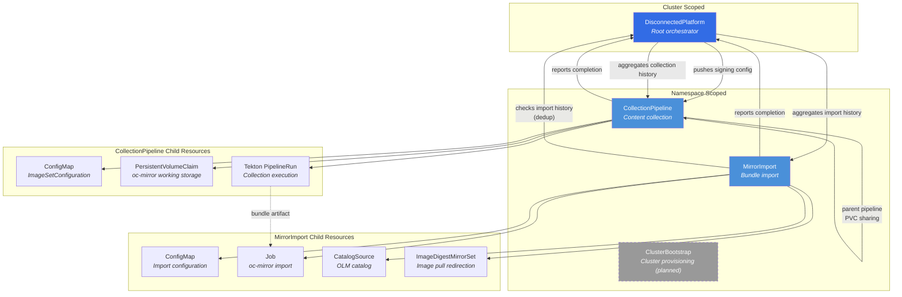
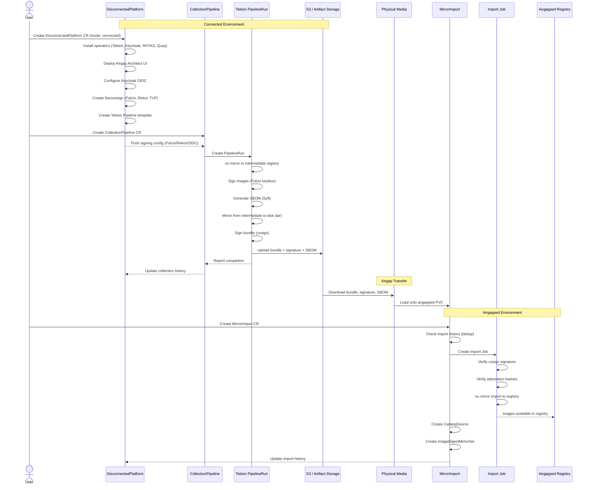
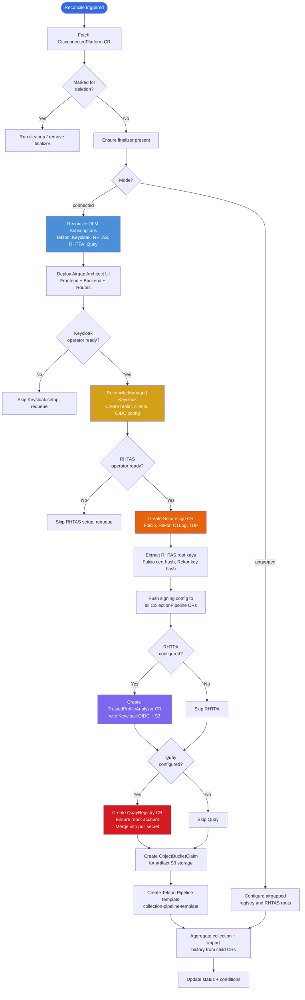
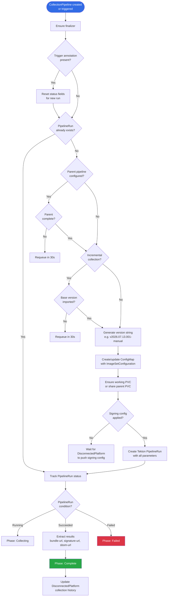
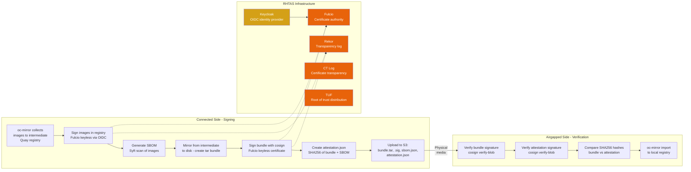

# Architecture Guide

The mirror-operator automates the lifecycle of disconnected (airgapped) OpenShift environments. In these environments, production clusters have no internet access -- all container images, operators, and platform updates must be collected on a connected system, transferred via physical media, and imported into the airgapped cluster's registry.

This operator replaces manual `oc-mirror` workflows with a declarative, Kubernetes-native automation layer built on Tekton Pipelines, with integrated supply chain security via Red Hat Trusted Artifact Signer (RHTAS).

## Custom Resource Relationships

The operator defines four Custom Resource Definitions that work together in a layered architecture. `DisconnectedPlatform` is the cluster-scoped root resource that installs prerequisites and manages configuration. The namespace-scoped resources (`CollectionPipeline`, `MirrorImport`, `ClusterBootstrap`) handle specific workflow stages.

The dashed border on `ClusterBootstrap` indicates it is a planned feature -- the controller currently only sets an initial `Pending` phase.

## End-to-End Workflow

The complete disconnected mirror workflow spans two environments separated by an airgap. The connected environment collects content from the internet, signs it, and packages it into a transferable bundle. The airgapped environment verifies and imports the bundle into its local registry.

## DisconnectedPlatform Reconciliation Flow

The `DisconnectedPlatform` controller is the most complex controller in the operator. It manages the entire infrastructure stack on the connected side and aggregates status from all child resources. The reconciliation follows a sequential dependency chain -- each component depends on the previous ones being ready.

## Collection Pipeline Lifecycle

The `CollectionPipeline` controller manages individual collection runs. Each CollectionPipeline CR goes through a series of phases as the Tekton PipelineRun executes.

## Supply Chain Security

The operator implements a complete supply chain security model using Red Hat Trusted Artifact Signer (RHTAS), which provides a private Sigstore deployment. Every collection produces signed artifacts with full provenance, and every import can verify the chain before trusting the content.

### Key Security Properties

- **Keyless signing**: No long-lived signing keys to manage. Fulcio issues short-lived certificates based on OIDC identity, and all signing events are recorded in Rekor's immutable transparency log.
- **Private Sigstore**: The operator deploys its own RHTAS instance rather than using the public Sigstore infrastructure. This means verification on the airgapped side uses your organization's root of trust, not a public one.
- **Attestation verification**: The import side verifies not just the bundle signature, but also an attestation document that binds the bundle's SHA256 hash to the SBOM's hash -- ensuring the SBOM matches the exact bundle being imported.
- **RHTAS root key distribution**: Root keys (Fulcio certificate hash, Rekor public key hash) must be securely transferred to the airgapped environment out-of-band. See [RHTAS Key Distribution](../hack/RHTAS_KEY_DISTRIBUTION.md) for the operational procedure.

## Managed Components

On the connected side, the `DisconnectedPlatform` controller installs and configures the following operator ecosystem via OLM subscriptions:

| Component | Operator | Purpose |
|-----------|----------|---------|
| **Tekton Pipelines** | `openshift-pipelines-operator-rh` | Runs the collection pipeline (oc-mirror, signing, packaging) |
| **Red Hat Build of Keycloak** | `rhbk-operator` | Provides OIDC identity for Fulcio keyless signing |
| **RHTAS** | `rhtas-operator` | Deploys Fulcio, Rekor, CTLog, Trillian, and TUF for supply chain signing |
| **RHTPA** | `trustification-operator` | Deploys Trustify for SBOM storage and vulnerability analysis |
| **Quay** | `quay-operator` | Provides an intermediate registry for the three-phase signing workflow |

Each operator subscription can be individually disabled or customized (channel, source, namespace) via the `spec.connected.operators` configuration.

In addition to operator subscriptions, the controller deploys the **Airgap Architect** web UI (React frontend + Node.js backend) with optional OpenShift console plugin integration, and manages all supporting infrastructure: managed PostgreSQL instances for Keycloak and RHTPA, S3 storage via ObjectBucketClaims, TLS certificates, and the cluster pull secret.
