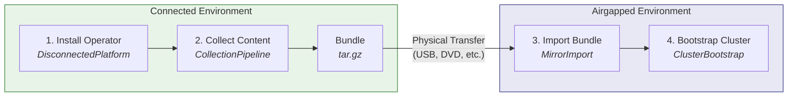

# End-to-End Guide: Disconnected OpenShift with mirror-operator

This guide walks through the complete workflow for managing disconnected OpenShift environments using the mirror-operator: installing the operator, collecting content into a bundle, importing the bundle into an airgapped registry, and bootstrapping a new cluster from mirrored content.

Before you begin, ensure your environment meets the requirements in the [Prerequisites and Environment Setup](prerequisites.md) guide.

## Table of Contents

- [Workflow Overview](#workflow-overview)
- [Phase 1: Installation and Platform Setup](#phase-1-installation-and-platform-setup)
- [Phase 2: Creating a Content Bundle](#phase-2-creating-a-content-bundle)
- [Phase 3: Transferring and Importing](#phase-3-transferring-and-importing)
- [Phase 4: Provisioning Additional Clusters](#phase-4-provisioning-additional-clusters)
- [Troubleshooting](#troubleshooting)
- [Next Steps](#next-steps)

## Workflow Overview

The mirror-operator automates a four-phase workflow that moves content from internet-connected sources into airgapped environments:



### Naming Conventions Used in This Guide

All examples in this guide use consistent names so you can trace resources across phases:

| Resource | Name | Namespace |
|----------|------|-----------|
| Connected platform | `disconnected-platform` | `mirror-operator-system` |
| Airgapped platform | `disconnected-platform-airgapped` | `mirror-operator-system` |
| Collection pipeline | `collection-v4-17` | `mirror-operator-system` |
| Mirror import | `import-v4-17` | `mirror-operator-system` |
| Cluster bootstrap | `production-cluster-01` | `mirror-operator-system` |
| Connected registry | `quay.example.com/mirror` | -- |
| Airgapped registry | `quay.airgap.local/mirror` | -- |
| OpenShift version | 4.17 | -- |
| Collection version | `v2026.05.26.001-manual` | -- |

---

## Phase 1: Installation and Platform Setup

### 1.1 Installing the Operator

#### Via OLM (Recommended)

The mirror-operator is available from the community operators catalog.

1. Navigate to **OperatorHub** in the OpenShift console
2. Search for **Mirror Operator**
3. Click **Install** and accept the default settings (namespace: `mirror-operator-system`, channel: `alpha`)
4. Wait for the operator to reach the **Succeeded** phase


Or install via CLI with a Subscription:

```yaml
apiVersion: operators.coreos.com/v1alpha1
kind: Subscription
metadata:
  name: mirror-operator
  namespace: mirror-operator-system
spec:
  channel: alpha
  name: mirror-operator
  source: community-operators
  sourceNamespace: openshift-marketplace
```

```bash
oc apply -f subscription.yaml
```


#### From Source (Development)

For development or testing, install directly from the repository:

```bash
git clone https://github.com/mathianasj/mirror-operator.git
cd mirror-operator
make install   # Install CRDs
make deploy    # Deploy the operator
```

#### Verifying the Installation

Confirm the operator is running:

```bash
oc get pods -n mirror-operator-system -l control-plane=controller-manager
```

Expected output:

```
NAME                                                READY   STATUS    RESTARTS   AGE
mirror-operator-controller-manager-xxxxx-yyyyy      1/1     Running   0          2m
```

Confirm the CRDs are installed:

```bash
oc get crd | grep mirror.mathianasj.github.com
```

Expected output:

```
clusterbootstraps.mirror.mirror.mathianasj.github.com        2026-05-26T00:00:00Z
collectionpipelines.mirror.mirror.mathianasj.github.com      2026-05-26T00:00:00Z
disconnectedplatforms.mirror.mirror.mathianasj.github.com    2026-05-26T00:00:00Z
mirrorimports.mirror.mirror.mathianasj.github.com            2026-05-26T00:00:00Z
```

### 1.2 Creating the Connected Platform

The `DisconnectedPlatform` resource is the top-level orchestrator. In `connected` mode, it installs dependencies (Tekton Pipelines, Keycloak, RHTAS) and configures the environment for content collection.

Apply the following CR:

```yaml
apiVersion: mirror.mirror.mathianasj.github.com/v1
kind: DisconnectedPlatform
metadata:
  name: disconnected-platform
spec:
  mode: connected
  connected:
    collectionSchedule: "0 2 * * 0"
    triggerTypes:
      - scheduled
      - manual
    operators:
      openshiftPipelines: {}
      keycloak: {}
      rhtas: {}
      rhtpa: {}
      quayOperator: {}
      osus: {}
    rhtas:
      oidc:
        managed:
          enabled: true
          realm: trusted-artifact-signer
    rhtpa:
      storage:
        type: local
        size: 200Gi
    quay:
      managed:
        enabled: true
    # Change this to your cluster's cert-manager ClusterIssuer name
    certIssuer:
      name: letsencrypt-production-ec2
  architect:
    enabled: true
```

> **Note:** The `certIssuer.name` must reference an existing cert-manager `ClusterIssuer` on your cluster. This is used by managed Keycloak for TLS certificate provisioning. See the [Prerequisites](prerequisites.md) for cert-manager requirements.

```bash
oc apply -f disconnected-platform.yaml
```

#### Verifying Platform Setup

Check the platform status:

```bash
oc get disconnectedplatform disconnected-platform -n mirror-operator-system -o yaml
```

The operator reconciles dependencies in order. Monitor the status conditions to track progress:

```bash
oc get disconnectedplatform disconnected-platform -n mirror-operator-system \
  -o jsonpath='{.status.conditions}' | jq
```

Verify the managed components are running:

| Component | How to Check |
|-----------|-------------|
| Tekton Pipelines | `oc get pods -n openshift-pipelines` |
| Keycloak (if RHTAS enabled) | `oc get pods -n mirror-operator-system -l app=keycloak` |
| RHTAS (if enabled) | `oc get securesign -n mirror-operator-system` |
| Architect Backend | `oc get pods -n openshift-airgap-architect -l app.kubernetes.io/component=backend` |
| Architect Frontend | `oc get pods -n openshift-airgap-architect -l app.kubernetes.io/component=frontend` |

For a detailed explanation of the reconciliation flow, see the [Architecture Guide](architecture.md).

### 1.3 Enabling the Airgap Architect Console Plugin

The Airgap Architect provides a management UI for collections, imports, and cluster configuration, embedded directly in the OpenShift console. This gives you a single pane of glass for managing your disconnected environment alongside your existing cluster operations.

The console plugin is deployed automatically when `architect.enabled: true` is set (as in the CR above). After the operator deploys the plugin, enable it in the Console operator:

```bash
oc patch console.operator.openshift.io cluster \
  --type='json' \
  -p='[{"op": "add", "path": "/spec/plugins/-", "value": "airgap-architect-plugin"}]'
```

Verify the plugin is registered:

```bash
oc get consoleplugin airgap-architect-plugin
```

Verify the plugin pod is running:

```bash
oc get pods -n openshift-airgap-architect -l app.kubernetes.io/component=console-plugin
```

Then refresh your browser (Ctrl+Shift+R / Cmd+Shift+R) and navigate to **Administrator** > **Airgap Architect**.


For alternative deployment modes (standalone route or hybrid), troubleshooting, and advanced configuration, see the [Console Plugin Integration Guide](console-plugin-integration.md).

---

## Phase 2: Creating a Content Bundle

With the platform running on the connected side, you can now collect container images, operator catalogs, and platform content into a portable bundle for transfer to the airgapped environment.

### 2.1 Configuring What to Mirror

The `ImageSetConfiguration` defines what content to collect. It has three main sections:

| Section | Purpose | Example |
|---------|---------|---------|
| `platform.channels` | OpenShift release images | `stable-4.17` |
| `operators` | Operator catalogs and packages | `redhat-operator-index:v4.17` |
| `additionalImages` | Extra container images | `ose-cli:v4.17` |

#### Using the Console Plugin

The Airgap Architect console plugin provides a 4-step wizard for building the ImageSetConfiguration and creating the collection:

1. Navigate to **Administrator** > **Airgap Architect** in the OpenShift console
2. Click **Create Collection** to launch the wizard

| Step | Name | What You Do |
|------|------|-------------|
| 1 | Release Selection | Select the OpenShift channel (e.g., `stable-4.17`) and patch version to mirror |
| 2 | Operators | Select operator catalogs and individual packages to include |
| 3 | Additional Images | Add any extra container images beyond platform and operators |
| 4 | Create Pipeline | Review the generated ImageSetConfiguration and create the `CollectionPipeline` CR |


For delta/update collections, click **Create Update** from an existing collection. Steps 1 and 2 show the parent's existing selections and let you modify them.

#### Writing ImageSetConfiguration Manually

If you prefer CLI, write the configuration directly. Here is an example that collects OpenShift 4.17, the Red Hat operator catalog, and the mirror-operator itself for airgapped use:

```yaml
kind: ImageSetConfiguration
apiVersion: mirror.openshift.io/v1alpha2
storageConfig:
  local:
    path: /workspace/output
mirror:
  platform:
    channels:
      - name: stable-4.17
        type: ocp
  operators:
    - catalog: registry.redhat.io/redhat/redhat-operator-index:v4.17
      full: true
    - catalog: registry.redhat.io/redhat/community-operator-index:v4.17
      packages:
        - name: mirror-operator
  additionalImages:
    - name: registry.redhat.io/openshift4/ose-cli:v4.17
```

> **Note:** The `storageConfig.local.path` must be `/workspace/output` — this is where the Tekton pipeline mounts the working PVC.

### 2.2 Creating a CollectionPipeline

The `CollectionPipeline` CR triggers the collection. The operator creates a Tekton PipelineRun that runs oc-mirror, signs the output, generates SBOMs, and uploads the bundle to S3.

```yaml
apiVersion: mirror.mirror.mathianasj.github.com/v1
kind: CollectionPipeline
metadata:
  name: collection-v4-17
spec:
  imageSetConfig: |
    kind: ImageSetConfiguration
    apiVersion: mirror.openshift.io/v1alpha2
    storageConfig:
      local:
        path: /workspace/output
    mirror:
      platform:
        channels:
          - name: stable-4.17
            type: ocp
      operators:
        - catalog: registry.redhat.io/redhat/redhat-operator-index:v4.17
          full: true
        - catalog: registry.redhat.io/redhat/community-operator-index:v4.17
          packages:
            - name: mirror-operator
      additionalImages:
        - name: registry.redhat.io/openshift4/ose-cli:v4.17
  triggerType: manual
```

```bash
oc apply -f collection-pipeline.yaml
```


Key fields:

| Field | Description |
|-------|-------------|
| `imageSetConfig` | Inline oc-mirror ImageSetConfiguration YAML |
| `triggerType` | `manual` (on-demand), `scheduled` (cron-driven), or `event` (webhook) |
| `timeout` | Pipeline timeout (defaults to 12h, increase for large collections) |
| `storageSize` | Working PVC size (defaults to 100Gi) |

> **Note:** The `signing` and `storage.output` fields are managed automatically by the operator — signing is configured via keyless RHTAS from the DisconnectedPlatform, and bundle output goes to S3 via the managed ObjectBucketClaim. You do not need to set these.

### 2.3 Monitoring the Collection

Watch the pipeline progress:

```bash
oc get collectionpipeline collection-v4-17 -w
```

The collection progresses through these phases:

| Phase | Description |
|-------|-------------|
| `Pending` | Waiting for signing configuration from the DisconnectedPlatform controller |
| `Collecting` | Tekton PipelineRun is active — oc-mirror is downloading content |
| `Complete` | Bundle has been uploaded to S3, signatures and SBOMs generated |
| `Failed` | An error occurred — check pipeline logs |


To inspect the Tekton pipeline run directly:

```bash
# Get the PipelineRun name
oc get collectionpipeline collection-v4-17 \
  -o jsonpath='{.status.pipelineRunRef}'

# View pipeline logs (requires tkn CLI)
tkn pipelinerun logs <pipelinerun-name> -f

# Or view logs via oc
oc logs -f -l tekton.dev/pipelineRun=<pipelinerun-name> --all-containers
```


### 2.4 Verifying Collection Output

When the collection completes, check the status for the bundle location and version:

```bash
oc get collectionpipeline collection-v4-17 -o jsonpath='{.status}' | jq
```

Key status fields:

| Field | Example | Description |
|-------|---------|-------------|
| `version` | `v2026.05.26.001-manual` | Unique version identifier for this collection |
| `bundleUrl` | `s3://collection-artifacts/...` | S3 location of the bundle tar |
| `signatureUrl` | `s3://collection-artifacts/...` | Cosign signature for the bundle |
| `sbomUrl` | `s3://collection-artifacts/...` | SBOM for the collected images |


The bundle contains:

```
bundle.tar.gz
├── oc-mirror-output/           # Mirrored images and catalogs
│   ├── mirror_seq1_000000.tar
│   ├── publish/
│   └── ...
├── airgap-architect-frontend.tar.gz   # Architect frontend image
├── airgap-architect-backend.tar.gz    # Architect backend image
└── import-airgap-architect.sh         # Import and run script
```

### 2.5 Advanced: Delta Collections

After an initial full collection, subsequent collections can reuse the oc-mirror cache to generate smaller delta bundles containing only new or changed content.

Create a child pipeline that references the parent:

```yaml
apiVersion: mirror.mirror.mathianasj.github.com/v1
kind: CollectionPipeline
metadata:
  name: collection-v4-17-update
spec:
  parentPipeline: collection-v4-17
  imageSetConfig: |
    kind: ImageSetConfiguration
    apiVersion: mirror.openshift.io/v1alpha2
    storageConfig:
      local:
        path: /workspace/output
    mirror:
      platform:
        channels:
          - name: stable-4.17
            type: ocp
      operators:
        - catalog: registry.redhat.io/redhat/redhat-operator-index:v4.17
          full: true
        - catalog: registry.redhat.io/redhat/community-operator-index:v4.17
          packages:
            - name: mirror-operator
            - name: openshift-gitops-operator
      additionalImages:
        - name: registry.redhat.io/openshift4/ose-cli:v4.17
  triggerType: manual
```

The child pipeline reuses the parent's working PVC (oc-mirror cache), so only new or changed images are downloaded. The resulting bundle is significantly smaller.


For details on parent pipeline validation, PVC sharing, and lineage tracking, see the [Parent Pipeline Implementation Guide](parent-pipeline-implementation-summary.md).

---

## Phase 3: Transferring and Importing

Once a collection completes on the connected side, the bundle needs to be physically transferred and imported into the airgapped environment. There are two distinct import paths depending on whether you already have a running cluster:

| Path | When to Use | Tool |
|------|-------------|------|
| **Path A: Bootstrap Import** | No cluster exists yet — you need to stand up cluster 0 | Import script + Airgap Architect on bastion host |
| **Path B: Ongoing Import** | Cluster 0 is running — ongoing content updates | MirrorImport CRs via the mirror-operator |

Most environments start with Path A to bootstrap their first cluster, then transition to Path B for day-2 content updates.

### 3.1 Physical Transfer

Download the bundle from S3 on the connected side. The collection status provides the bundle URL:

```bash
oc get collectionpipeline collection-v4-17 \
  -o jsonpath='{.status.bundleUrl}'
```

Transfer the bundle file to the airgapped environment using your approved transfer mechanism (USB drive, DVD, cross-domain solution, etc.).

- **Path A:** Place the bundle on the bastion host where you will run the import script
- **Path B:** Place the bundle on the import node at the path configured in the airgapped platform's `importPath` (e.g., `/mnt/physical-media`)

---

### Path A: Bootstrap Import (Pre-Cluster)

Use this path when no OpenShift cluster exists in the airgapped environment yet. The import script runs on a bastion host (a RHEL system with podman) and handles everything needed to prepare for cluster installation:

1. Installs CLI tools (oc, oc-mirror, openshift-install) from the bundle
2. Installs or connects to a mirror registry (Quay)
3. Mirrors the bundle's images into the registry using oc-mirror
4. Starts the Airgap Architect UI for creating the cluster installation ISO

#### 3.A.1 Prerequisites

The bastion host needs:

| Requirement | Details |
|-------------|---------|
| RHEL 8 or 9 | Bastion operating system |
| podman | For running the Airgap Architect containers |
| Network access | To the mirror registry (can be on the same host) |
| Disk space | Enough for the bundle + extracted images + registry storage |

#### 3.A.2 Extracting and Running the Import Script

Extract the collection bundle and run the import script:

```bash
tar -xzf bundle.tar.gz
cd <extracted-bundle-directory>
./import-airgap-architect.sh start
```

The script is interactive and walks you through the setup. On first run, it will:

1. **Install CLI tools** — Extracts `oc`, `oc-mirror`, `kubectl`, and `openshift-install` from the bundle and installs them to `~/.local/bin` (or `/usr/local/bin` on STIG-hardened systems)

2. **Configure a mirror registry** — Prompts you to choose:
   - **Install mirror-registry (Quay)** on this host — the script handles installation, TLS certificates, and initial configuration
   - **Use an existing registry** — provide the URL and credentials, the script validates the connection
   - **Skip registry setup** — if you plan to configure it manually later

3. **Mirror images** — Runs `oc-mirror` to push all images from the bundle archives into the registry. This generates IDMS/ITMS and CatalogSource manifests needed for cluster installation.

4. **Start the Airgap Architect UI** — Imports the frontend and backend container images and starts them via podman

After completion, the Airgap Architect UI is available at `http://localhost:5173` and the backend API at `http://localhost:4000`.

#### 3.A.3 Non-Interactive Mode

For automated deployments, configure the script via environment variables instead of interactive prompts:

```bash
MIRROR_REGISTRY_INSTALL=true \
MIRROR_REGISTRY_HOSTNAME=bastion.lab.local \
MIRROR_REGISTRY_PORT=8443 \
MIRROR_REGISTRY_INIT_PASSWORD=SecurePass123 \
./import-airgap-architect.sh start
```

Or to use an existing registry:

```bash
MIRROR_REGISTRY_EXISTING=true \
EXISTING_REGISTRY_URL=registry.example.com:8443 \
EXISTING_REGISTRY_USERNAME=admin \
EXISTING_REGISTRY_PASSWORD=mypassword \
./import-airgap-architect.sh start
```

See `./import-airgap-architect.sh --help` for all environment variables.

#### 3.A.4 Managing the Import Environment

The import script provides lifecycle commands:

| Command | Description |
|---------|-------------|
| `./import-airgap-architect.sh start` | Start (imports images and mirrors to registry if needed) |
| `./import-airgap-architect.sh stop` | Stop the Architect containers |
| `./import-airgap-architect.sh restart` | Restart the Architect containers |
| `./import-airgap-architect.sh status` | Show container status |
| `./import-airgap-architect.sh logs` | View container logs |
| `./import-airgap-architect.sh mirror` | Re-run the mirror step only |
| `./import-airgap-architect.sh clean` | Remove containers and images (preserves data) |
| `./import-airgap-architect.sh uninstall-mirror-registry` | Uninstall the mirror-registry from this host |

#### 3.A.5 STIG/FIPS-Hardened Environments

The import script automatically detects DISA STIG-hardened systems (noexec on /home, restrictive umask, fapolicyd, disabled user namespaces) and adjusts its behavior:

- Installs CLI tools to `/usr/local/bin` instead of `~/.local/bin`
- Temporarily stops fapolicyd during installation and adds tools to the trust list
- Increases `user.max_user_namespaces` for rootless podman
- Sets appropriate SELinux contexts on binaries

No manual intervention is required — the script prompts for sudo access when needed. For details, see the [STIG and FIPS Compliance Guide](stig-fips-compliance.md).

#### 3.A.6 Creating Cluster 0

With the registry populated and the Airgap Architect UI running at `http://localhost:5173`, use it to create your first cluster. Because the import script mounted the registry configuration, the UI runs in **preloaded mode** — mirror registry settings, CA certificates, pull secrets, and mirror sources are pre-populated and locked so you cannot accidentally misconfigure them.

Open the Airgap Architect UI and click **Start new install** on the landing page. The wizard walks through these steps:

| Step | Name | What You Do |
|------|------|-------------|
| 1 | Blueprint | Select target platform (Bare Metal, vSphere, etc.), CPU architecture, and OpenShift version. The version is pre-populated from the bundle's ImageSetConfiguration. |
| 2 | Methodology | Choose install method — **Agent-Based Installer** is recommended for airgapped bare metal and vSphere environments. |
| 3 | Identity & Access | Set cluster name (e.g., `production-cluster-01`), base domain (e.g., `airgap.local`), and SSH public key. Mirror registry and pull secret fields are pre-configured and read-only. |
| 4 | Networking | Configure IP stack, machine network CIDR, cluster/service network CIDRs, and API/Ingress VIPs. |
| 5 | Connectivity & Mirroring | Mirror registry FQDN and mirror sources (from IDMS/ITMS) are pre-configured and read-only. Configure NTP servers if needed. |
| 6 | Trust & Proxy | Mirror registry CA certificate is pre-loaded. Add any additional CA certificates or proxy settings. |
| 7 | Platform Specifics | Platform-specific settings — vCenter credentials for vSphere, boot artifact type for bare metal, etc. |
| 8 | Hosts / Inventory | Define cluster nodes — hostnames, MAC addresses, BMC credentials, and network configuration for each control plane and worker node. |
| 9 | Assets & Guide | Review the generated `install-config.yaml` and `agent-config.yaml`. Download individual files or the complete deployment bundle. |
| 10 | Generate Agent ISO | Click **Generate ISO** to run `openshift-install agent create image`. Download the generated ISO and note the kubeadmin credentials. |

> **Note:** The "Operators" and "Run oc-mirror" steps that appear in the non-preloaded flow are hidden — operators are already defined in the bundle's ImageSetConfiguration and mirroring was completed by the import script.

Boot your target nodes from the generated agent ISO to begin the cluster installation. The ISO includes all mirrored content references so the installer pulls images from your local registry.

#### 3.A.7 Post-Install: Configuring Storage

After the cluster finishes its initial bootstrap and the API is reachable, log in and configure a storage provider. Several cluster components (registry, monitoring, logging) require PersistentVolumeClaims and will remain pending until storage is available.

```bash
export KUBECONFIG=<path-to-kubeadmin-kubeconfig>
oc login -u kubeadmin -p <password-from-step-10>
```

Install and configure the appropriate storage solution for your platform (e.g., OpenShift Data Foundation, local-storage operator, vSphere CSI driver, NFS provisioner). Once a default `StorageClass` is available, pending PVC-dependent components will complete their installation automatically.

```bash
oc get storageclass
oc get pvc -A --field-selector='status.phase!=Bound'
```

> **Tip:** After storage is configured and all cluster operators are available (`oc get clusteroperators`), transition to **Path B** for ongoing content updates. Install the mirror-operator on the new cluster and create a `DisconnectedPlatform` in `airgapped` mode.

---

### Path B: Ongoing Import (Post-Cluster)

Use this path when you already have a running OpenShift cluster in the airgapped environment and want to import new content bundles on an ongoing basis.

#### 3.B.1 Setting Up the Airgapped Platform

On the airgapped OpenShift cluster, install the mirror-operator from the mirrored catalog (the collection bundle includes the mirror-operator in the community operator index).

Create the `DisconnectedPlatform` CR in `airgapped` mode:

```yaml
apiVersion: mirror.mirror.mathianasj.github.com/v1
kind: DisconnectedPlatform
metadata:
  name: disconnected-platform-airgapped
spec:
  mode: airgapped
  airgapped:
    managementCluster: true
    importPath: /mnt/physical-media
    quay:
      enabled: true
    acm:
      hostInventory:
        infraEnv:
          enabled: true
      subscription:
        catalogSource: cs-redhat-operator-index
  architect:
    enabled: true
```

```bash
oc apply -f disconnected-platform-airgapped.yaml
```

Key fields:

| Field | Description |
|-------|-------------|
| `managementCluster` | Marks this cluster as the management hub |
| `importPath` | Host filesystem path where bundles are placed for import |
| `quay.enabled` | Deploys a managed Quay registry as the mirror target |
| `acm.hostInventory` | Enables ACM assisted installer for bare-metal provisioning |
| `acm.subscription.catalogSource` | CatalogSource name for ACM from mirrored content |

The operator will:
- Deploy a managed Quay registry for mirrored images
- Create an import scanner CronJob that watches `importPath` for new bundles
- Set up ACM with host inventory for cluster provisioning
- Deploy the Airgap Architect console plugin

> **Note:** The import node must be labeled for the scanner CronJob to schedule on it:
> ```bash
> oc label node <node-name> mirror-operator.io/import-node=true
> ```

#### 3.B.2 Importing via the Console Plugin

On the airgapped side, the Airgap Architect console plugin switches to import mode automatically. Navigate to **Administrator** > **Airgap Architect** — you will see the import list view instead of the collection view.

Click **Import Bundle** to launch the 4-step import wizard:

| Step | Name | What You Do |
|------|------|-------------|
| 1 | Bundle Source | Choose how to provide the bundle: **Upload from browser** (drag-and-drop a tar file) or **Select from import volume** (pick a file already on the PVC at the `importPath`) |
| 2 | Storage | Create a new PVC or select an existing one for the import working space. The wizard auto-suggests a size at 3.5x the bundle size. |
| 3 | Configuration | Set the target mirror registry URL. Toggle publish options: **CatalogSource creation** and **ICSP/IDMS creation**. |
| 4 | Review & Import | Review all settings and click **Import Bundle** to create the `MirrorImport` CR. If using browser upload, the file is uploaded via chunked transfer. |

After creation, the import detail view shows the pipeline progress, task status, duration, bundle info, and publish options.


#### 3.B.3 Automatic Bundle Import (Alternative)

Instead of using the console plugin wizard, you can rely on the automatic scanner. When `importPath` is configured, the operator creates a CronJob (`import-bundle-scanner`) that runs every 30 minutes by default. The scanner:

1. Scans `importPath` for `.tar` and `.tar.gz` files
2. Extracts the `imageset-config.yaml` from each bundle
3. Creates a `MirrorImport` CR for each unprocessed bundle
4. Skips bundles that already have a corresponding `MirrorImport` CR

This means importing can be fully automatic — just drop the bundle file at the import path and wait for the next scan cycle.

To trigger an immediate scan instead of waiting:

```bash
oc create job --from=cronjob/import-bundle-scanner import-now \
  -n openshift-airgap-architect
```

Monitor the auto-created `MirrorImport` resources:

```bash
oc get mirrorimport -n openshift-airgap-architect
```

#### 3.B.4 Manual Import via CLI (Alternative)

If you prefer full control, create a `MirrorImport` CR manually:

```yaml
apiVersion: mirror.mirror.mathianasj.github.com/v1
kind: MirrorImport
metadata:
  name: import-v4-17
spec:
  imageSetConfig: |
    kind: ImageSetConfiguration
    apiVersion: mirror.openshift.io/v2alpha1
    mirror:
      operators:
        - catalog: registry.redhat.io/redhat/redhat-operator-index:v4.17
  bundle:
    pvc: import-data
    filename: release-v4.17.tar
  targetRegistry:
    url: https://quay.airgap.local
  publish:
    catalogSource: true
    imageContentSourcePolicy: true
  collectionVersion: v2026.05.26.001-manual
```

```bash
oc apply -f mirror-import.yaml
```

#### 3.B.5 Post-Import Verification

After the import completes, verify that the mirrored content is available.

**CatalogSource** — The import creates a `CatalogSource` pointing to the mirrored operator index in your registry:

```bash
oc get catalogsource -n openshift-marketplace
```


**ImageDigestMirrorSet** — The import creates an `ImageDigestMirrorSet` (or `ImageContentSourcePolicy` on older clusters) that redirects image pulls from upstream registries to the mirror:

```bash
oc get imagedigestmirrorset
```


For details on IDMS configuration and registries.conf generation, see the [IDMS-Based registries.conf Guide](idms-based-registries-conf.md).

**Verify Operators in OperatorHub** — Navigate to **OperatorHub** in the OpenShift console and confirm that operators from the mirrored catalog are available for installation.

---

## Phase 4: Provisioning Additional Clusters

> **Note:** The `ClusterBootstrap` CRD is in early implementation. The controller currently accepts the CR and sets the phase to `Pending` but does not yet orchestrate the full installation workflow. For bootstrapping your first cluster (cluster 0), use the Airgap Architect UI as described in [Path A: Bootstrap Import](#path-a-bootstrap-import-pre-cluster). This section documents the intended workflow for provisioning additional clusters from the management hub once cluster 0 is running.

### 4.1 Creating a ClusterBootstrap

With the management cluster running and content imported, you can provision additional clusters using the `ClusterBootstrap` CR.

First, create the prerequisite resources:

```bash
# Create install-config secret (generated by Airgap Architect or written manually)
oc create secret generic cluster-install-config \
  --from-file=install-config.yaml \
  -n mirror-operator-system

# Create pull secret for the new cluster
oc create secret generic mirror-pull-secret \
  --from-file=.dockerconfigjson=pull-secret.json \
  --type=kubernetes.io/dockerconfigjson \
  -n mirror-operator-system
```

Then create the `ClusterBootstrap` CR:

```yaml
apiVersion: mirror.mirror.mathianasj.github.com/v1
kind: ClusterBootstrap
metadata:
  name: production-cluster-01
spec:
  version: v2026.05.26.001-manual
  platform: vsphere
  installConfig:
    name: cluster-install-config
  mirrorRegistry: quay.airgap.local:8443/mirror
  pullSecret:
    name: mirror-pull-secret
  controlPlane:
    replicas: 3
  compute:
    replicas: 3
```

```bash
oc apply -f cluster-bootstrap.yaml
```

Key fields:

| Field | Description |
|-------|-------------|
| `version` | Collection version to use for cluster images |
| `platform` | Target platform: `vsphere`, `baremetal`, or `none` |
| `installConfig` | Secret containing the `install-config.yaml` |
| `mirrorRegistry` | Registry URL where mirrored content is stored |
| `pullSecret` | Secret with registry credentials for the new cluster |
| `controlPlane.replicas` | Number of control plane nodes |
| `compute.replicas` | Number of worker nodes |

### 4.2 Monitoring Bootstrap Progress

Check the bootstrap status:

```bash
oc get clusterbootstrap production-cluster-01 -o yaml
```

The expected lifecycle phases (once fully implemented):

| Phase | Description |
|-------|-------------|
| `Pending` | CR accepted, waiting to begin |
| `Validating` | Validating install-config, platform configuration, and registry access |
| `Installing` | Orchestrating `openshift-install` to provision the cluster |
| `Complete` | Cluster is running — kubeconfig and console URL available in status |
| `Failed` | An error occurred — check conditions for details |


### 4.3 Post-Install Operators

The `postInstall` field allows automatic operator installation on the new cluster after it is provisioned:

```yaml
spec:
  postInstall:
    operators:
      - name: openshift-gitops-operator
        namespace: openshift-operators
        channel: latest
      - name: openshift-logging
        namespace: openshift-operators-redhat
        channel: stable-6.1
```

---

## Troubleshooting

| Issue | Symptom | Resolution |
|-------|---------|------------|
| Operator not reconciling | Pod running but no status updates | Check RBAC: `oc auth can-i create deployments --as=system:serviceaccount:mirror-operator-system:mirror-operator-controller-manager` |
| Collection stuck in Pending | CollectionPipeline stays in `Pending` phase | The operator is waiting for signing configuration from the DisconnectedPlatform. Verify RHTAS components are ready: `oc get securesign -n mirror-operator-system` |
| Collection pipeline fails | PipelineRun shows failed tasks | Check pipeline logs: `tkn pipelinerun logs <name> -f`. Common causes: insufficient PVC space, registry unreachable, expired pull secret. |
| Import fails | MirrorImport stuck or errored | Verify the bundle file is accessible at the PVC path. Check import job logs: `oc logs -l job-name=<import-job> -n openshift-airgap-architect` |
| CatalogSource not created | OperatorHub empty after import | Check that `publish.catalogSource: true` is set on the MirrorImport. Verify the CatalogSource pod is running: `oc get pods -n openshift-marketplace` |
| Console plugin not visible | No "Airgap Architect" in sidebar | Verify the plugin is enabled: `oc get console.operator.openshift.io cluster -o jsonpath='{.spec.plugins}'`. Refresh your browser with Ctrl+Shift+R. |
| Import scanner not running | No MirrorImports created from dropped bundles | Verify the import node is labeled: `oc get nodes -l mirror-operator.io/import-node=true`. Check the CronJob: `oc get cronjob import-bundle-scanner -n openshift-airgap-architect` |
| Import script fails on STIG system | Permission denied or fapolicyd blocks execution | Run with `STIG_MODE=true` (auto-detected in most cases). Ensure sudo access is available. See the [STIG Guide](stig-fips-compliance.md). |

For additional troubleshooting resources:
- [Mirror-From-Intermediate Troubleshooting](troubleshooting-mirror-from-intermediate.md)
- [Mirror-From-Intermediate Storage Fix](mirror-from-intermediate-storage-fix.md)

---

## Next Steps

With the operator running on both sides of the airgap, you have a fully automated pipeline for keeping disconnected environments current. Here are some areas to explore:

- **Scheduled collections** — Set `collectionSchedule` in the DisconnectedPlatform to automatically trigger collections on a cron schedule
- **Delta collections** — Use `parentPipeline` references to create incremental bundles. See the [Parent Pipeline Guide](parent-pipeline-implementation-summary.md).
- **Supply chain security** — Review the [RHTAS Integration Guide](rhtas-integration.md) for keyless signing, signature verification, and SBOM generation
- **Programmatic integration** — Use the operator's CRDs from Go, Python, or Ansible. See the [Integration Guide](integration-guide.md).
- **STIG/FIPS compliance** — For hardened environments, see the [STIG and FIPS Compliance Guide](stig-fips-compliance.md)
- **Architecture deep dive** — Understand the full reconciliation flow in the [Architecture Guide](architecture.md)
- **API reference** — Complete field documentation for all CRDs in the [CRD Reference](crd-reference.md)
