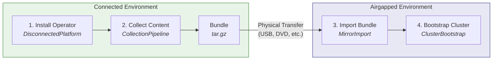

# End-to-End Guide: Disconnected OpenShift with mirror-operator

This guide walks through the complete workflow for managing disconnected OpenShift environments using the mirror-operator: installing the operator, collecting content into a bundle, importing the bundle into an airgapped registry, and bootstrapping a new cluster from mirrored content.

Before you begin, ensure your environment meets the requirements in the [Prerequisites and Environment Setup](prerequisites.md) guide.

## Table of Contents

- [Workflow Overview](#workflow-overview)
- [Phase 1: Installation and Platform Setup](#phase-1-installation-and-platform-setup)
- [Phase 2: Creating a Content Bundle](#phase-2-creating-a-content-bundle)
- [Phase 3: Transferring and Importing](#phase-3-transferring-and-importing) *(coming soon)*
- [Phase 4: Bootstrapping Cluster 0](#phase-4-bootstrapping-cluster-0) *(coming soon)*

## Workflow Overview

The mirror-operator automates a four-phase workflow that moves content from internet-connected sources into airgapped environments:



### Naming Conventions Used in This Guide

All examples in this guide use consistent names so you can trace resources across phases:

| Resource | Name | Namespace |
|----------|------|-----------|
| Connected platform | `disconnected-platform` | `mirror-operator-system` |
| Airgapped platform | `disconnected-platform-airgapped` | `mirror-operator-system` |
| Collection pipeline | `collection-v4-17` | `mirror-operator-system` |
| Mirror import | `import-v4-17` | `mirror-operator-system` |
| Cluster bootstrap | `production-cluster-01` | `mirror-operator-system` |
| Connected registry | `quay.example.com/mirror` | -- |
| Airgapped registry | `quay.airgap.local/mirror` | -- |
| OpenShift version | 4.17 | -- |
| Collection version | `v2026.05.26.001-manual` | -- |

---

## Phase 1: Installation and Platform Setup

### 1.1 Installing the Operator

#### Via OLM (Recommended)

The mirror-operator is available from the community operators catalog.

1. Navigate to **OperatorHub** in the OpenShift console
2. Search for **Mirror Operator**
3. Click **Install** and accept the default settings (namespace: `mirror-operator-system`, channel: `alpha`)
4. Wait for the operator to reach the **Succeeded** phase


Or install via CLI with a Subscription:

```yaml
apiVersion: operators.coreos.com/v1alpha1
kind: Subscription
metadata:
  name: mirror-operator
  namespace: mirror-operator-system
spec:
  channel: alpha
  name: mirror-operator
  source: community-operators
  sourceNamespace: openshift-marketplace
```

```bash
oc apply -f subscription.yaml
```


#### From Source (Development)

For development or testing, install directly from the repository:

```bash
git clone https://github.com/mathianasj/mirror-operator.git
cd mirror-operator
make install   # Install CRDs
make deploy    # Deploy the operator
```

#### Verifying the Installation

Confirm the operator is running:

```bash
oc get pods -n mirror-operator-system -l control-plane=controller-manager
```

Expected output:

```
NAME                                                READY   STATUS    RESTARTS   AGE
mirror-operator-controller-manager-xxxxx-yyyyy      1/1     Running   0          2m
```

Confirm the CRDs are installed:

```bash
oc get crd | grep mirror.mathianasj.github.com
```

Expected output:

```
clusterbootstraps.mirror.mirror.mathianasj.github.com        2026-05-26T00:00:00Z
collectionpipelines.mirror.mirror.mathianasj.github.com      2026-05-26T00:00:00Z
disconnectedplatforms.mirror.mirror.mathianasj.github.com    2026-05-26T00:00:00Z
mirrorimports.mirror.mirror.mathianasj.github.com            2026-05-26T00:00:00Z
```

### 1.2 Creating the Connected Platform

The `DisconnectedPlatform` resource is the top-level orchestrator. In `connected` mode, it installs dependencies (Tekton Pipelines, Keycloak, RHTAS) and configures the environment for content collection.

Apply the following CR:

```yaml
apiVersion: mirror.mirror.mathianasj.github.com/v1
kind: DisconnectedPlatform
metadata:
  name: disconnected-platform
spec:
  mode: connected
  connected:
    collectionSchedule: "0 2 * * 0"
    triggerTypes:
      - scheduled
      - manual
    operators:
      openshiftPipelines: {}
      keycloak: {}
      rhtas: {}
      rhtpa: {}
      quayOperator: {}
      osus: {}
    rhtas:
      oidc:
        managed:
          enabled: true
          realm: trusted-artifact-signer
    rhtpa:
      storage:
        type: local
        size: 200Gi
    quay:
      managed:
        enabled: true
    # Change this to your cluster's cert-manager ClusterIssuer name
    certIssuer:
      name: letsencrypt-production-ec2
  architect:
    enabled: true
```

> **Note:** The `certIssuer.name` must reference an existing cert-manager `ClusterIssuer` on your cluster. This is used by managed Keycloak for TLS certificate provisioning. See the [Prerequisites](prerequisites.md) for cert-manager requirements.

```bash
oc apply -f disconnected-platform.yaml
```

#### Verifying Platform Setup

Check the platform status:

```bash
oc get disconnectedplatform disconnected-platform -n mirror-operator-system -o yaml
```

The operator reconciles dependencies in order. Monitor the status conditions to track progress:

```bash
oc get disconnectedplatform disconnected-platform -n mirror-operator-system \
  -o jsonpath='{.status.conditions}' | jq
```

Verify the managed components are running:

| Component | How to Check |
|-----------|-------------|
| Tekton Pipelines | `oc get pods -n openshift-pipelines` |
| Keycloak (if RHTAS enabled) | `oc get pods -n mirror-operator-system -l app=keycloak` |
| RHTAS (if enabled) | `oc get securesign -n mirror-operator-system` |
| Architect Backend | `oc get pods -n openshift-airgap-architect -l app.kubernetes.io/component=backend` |
| Architect Frontend | `oc get pods -n openshift-airgap-architect -l app.kubernetes.io/component=frontend` |

For a detailed explanation of the reconciliation flow, see the [Architecture Guide](architecture.md).

### 1.3 Enabling the Airgap Architect Console Plugin

The Airgap Architect provides a management UI for collections, imports, and cluster configuration, embedded directly in the OpenShift console. This gives you a single pane of glass for managing your disconnected environment alongside your existing cluster operations.

The console plugin is deployed automatically when `architect.enabled: true` is set (as in the CR above). After the operator deploys the plugin, enable it in the Console operator:

```bash
oc patch console.operator.openshift.io cluster \
  --type='json' \
  -p='[{"op": "add", "path": "/spec/plugins/-", "value": "airgap-architect-plugin"}]'
```

Verify the plugin is registered:

```bash
oc get consoleplugin airgap-architect-plugin
```

Verify the plugin pod is running:

```bash
oc get pods -n openshift-airgap-architect -l app.kubernetes.io/component=console-plugin
```

Then refresh your browser (Ctrl+Shift+R / Cmd+Shift+R) and navigate to **Administrator** > **Airgap Architect**.


For alternative deployment modes (standalone route or hybrid), troubleshooting, and advanced configuration, see the [Console Plugin Integration Guide](console-plugin-integration.md).

---

## Phase 2: Creating a Content Bundle

With the platform running on the connected side, you can now collect container images, operator catalogs, and platform content into a portable bundle for transfer to the airgapped environment.

### 2.1 Configuring What to Mirror

The `ImageSetConfiguration` defines what content to collect. It has three main sections:

| Section | Purpose | Example |
|---------|---------|---------|
| `platform.channels` | OpenShift release images | `stable-4.17` |
| `operators` | Operator catalogs and packages | `redhat-operator-index:v4.17` |
| `additionalImages` | Extra container images | `ose-cli:v4.17` |

#### Using the Architect UI

The Airgap Architect console plugin provides a wizard for building the ImageSetConfiguration:

1. Navigate to **Administrator** > **Airgap Architect** in the OpenShift console
2. Select the operators, platform channels, and additional images to include
3. The wizard generates the ImageSetConfiguration YAML and creates the CollectionPipeline CR for you


#### Writing ImageSetConfiguration Manually

If you prefer CLI, write the configuration directly. Here is an example that collects OpenShift 4.17, the Red Hat operator catalog, and the mirror-operator itself for airgapped use:

```yaml
kind: ImageSetConfiguration
apiVersion: mirror.openshift.io/v1alpha2
storageConfig:
  local:
    path: /workspace/output
mirror:
  platform:
    channels:
      - name: stable-4.17
        type: ocp
  operators:
    - catalog: registry.redhat.io/redhat/redhat-operator-index:v4.17
      full: true
    - catalog: registry.redhat.io/redhat/community-operator-index:v4.17
      packages:
        - name: mirror-operator
  additionalImages:
    - name: registry.redhat.io/openshift4/ose-cli:v4.17
```

> **Note:** The `storageConfig.local.path` must be `/workspace/output` — this is where the Tekton pipeline mounts the working PVC.

### 2.2 Creating a CollectionPipeline

The `CollectionPipeline` CR triggers the collection. The operator creates a Tekton PipelineRun that runs oc-mirror, signs the output, generates SBOMs, and uploads the bundle to S3.

```yaml
apiVersion: mirror.mirror.mathianasj.github.com/v1
kind: CollectionPipeline
metadata:
  name: collection-v4-17
spec:
  imageSetConfig: |
    kind: ImageSetConfiguration
    apiVersion: mirror.openshift.io/v1alpha2
    storageConfig:
      local:
        path: /workspace/output
    mirror:
      platform:
        channels:
          - name: stable-4.17
            type: ocp
      operators:
        - catalog: registry.redhat.io/redhat/redhat-operator-index:v4.17
          full: true
        - catalog: registry.redhat.io/redhat/community-operator-index:v4.17
          packages:
            - name: mirror-operator
      additionalImages:
        - name: registry.redhat.io/openshift4/ose-cli:v4.17
  triggerType: manual
```

```bash
oc apply -f collection-pipeline.yaml
```


Key fields:

| Field | Description |
|-------|-------------|
| `imageSetConfig` | Inline oc-mirror ImageSetConfiguration YAML |
| `triggerType` | `manual` (on-demand), `scheduled` (cron-driven), or `event` (webhook) |
| `timeout` | Pipeline timeout (defaults to 12h, increase for large collections) |
| `storageSize` | Working PVC size (defaults to 100Gi) |

> **Note:** The `signing` and `storage.output` fields are managed automatically by the operator — signing is configured via keyless RHTAS from the DisconnectedPlatform, and bundle output goes to S3 via the managed ObjectBucketClaim. You do not need to set these.

### 2.3 Monitoring the Collection

Watch the pipeline progress:

```bash
oc get collectionpipeline collection-v4-17 -w
```

The collection progresses through these phases:

| Phase | Description |
|-------|-------------|
| `Pending` | Waiting for signing configuration from the DisconnectedPlatform controller |
| `Collecting` | Tekton PipelineRun is active — oc-mirror is downloading content |
| `Complete` | Bundle has been uploaded to S3, signatures and SBOMs generated |
| `Failed` | An error occurred — check pipeline logs |


To inspect the Tekton pipeline run directly:

```bash
# Get the PipelineRun name
oc get collectionpipeline collection-v4-17 \
  -o jsonpath='{.status.pipelineRunRef}'

# View pipeline logs (requires tkn CLI)
tkn pipelinerun logs <pipelinerun-name> -f

# Or view logs via oc
oc logs -f -l tekton.dev/pipelineRun=<pipelinerun-name> --all-containers
```


### 2.4 Verifying Collection Output

When the collection completes, check the status for the bundle location and version:

```bash
oc get collectionpipeline collection-v4-17 -o jsonpath='{.status}' | jq
```

Key status fields:

| Field | Example | Description |
|-------|---------|-------------|
| `version` | `v2026.05.26.001-manual` | Unique version identifier for this collection |
| `bundleUrl` | `s3://collection-artifacts/...` | S3 location of the bundle tar |
| `signatureUrl` | `s3://collection-artifacts/...` | Cosign signature for the bundle |
| `sbomUrl` | `s3://collection-artifacts/...` | SBOM for the collected images |


The bundle contains:

```
bundle.tar.gz
├── oc-mirror-output/           # Mirrored images and catalogs
│   ├── mirror_seq1_000000.tar
│   ├── publish/
│   └── ...
├── airgap-architect-frontend.tar.gz   # Architect frontend image
├── airgap-architect-backend.tar.gz    # Architect backend image
└── import-airgap-architect.sh         # Import and run script
```

### 2.5 Advanced: Delta Collections

After an initial full collection, subsequent collections can reuse the oc-mirror cache to generate smaller delta bundles containing only new or changed content.

Create a child pipeline that references the parent:

```yaml
apiVersion: mirror.mirror.mathianasj.github.com/v1
kind: CollectionPipeline
metadata:
  name: collection-v4-17-update
spec:
  parentPipeline: collection-v4-17
  imageSetConfig: |
    kind: ImageSetConfiguration
    apiVersion: mirror.openshift.io/v1alpha2
    storageConfig:
      local:
        path: /workspace/output
    mirror:
      platform:
        channels:
          - name: stable-4.17
            type: ocp
      operators:
        - catalog: registry.redhat.io/redhat/redhat-operator-index:v4.17
          full: true
        - catalog: registry.redhat.io/redhat/community-operator-index:v4.17
          packages:
            - name: mirror-operator
            - name: openshift-gitops-operator
      additionalImages:
        - name: registry.redhat.io/openshift4/ose-cli:v4.17
  triggerType: manual
```

The child pipeline reuses the parent's working PVC (oc-mirror cache), so only new or changed images are downloaded. The resulting bundle is significantly smaller.


For details on parent pipeline validation, PVC sharing, and lineage tracking, see the [Parent Pipeline Implementation Guide](parent-pipeline-implementation-summary.md).

---

*Phase 3 (Transferring and Importing) and Phase 4 (Bootstrapping Cluster 0) are covered in upcoming sections.*
