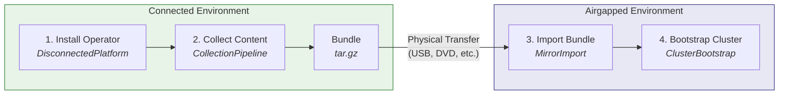

# End-to-End Guide: Disconnected OpenShift with mirror-operator

This guide walks through the complete workflow for managing disconnected OpenShift environments using the mirror-operator: installing the operator, collecting content into a bundle, importing the bundle into an airgapped registry, and bootstrapping a new cluster from mirrored content.

Before you begin, ensure your environment meets the requirements in the [Prerequisites and Environment Setup](prerequisites.md) guide.

## Table of Contents

- [Workflow Overview](#workflow-overview)
- [Phase 1: Installation and Platform Setup](#phase-1-installation-and-platform-setup)
- [Phase 2: Creating a Content Bundle](#phase-2-creating-a-content-bundle) *(coming soon)*
- [Phase 3: Transferring and Importing](#phase-3-transferring-and-importing) *(coming soon)*
- [Phase 4: Bootstrapping Cluster 0](#phase-4-bootstrapping-cluster-0) *(coming soon)*

## Workflow Overview

The mirror-operator automates a four-phase workflow that moves content from internet-connected sources into airgapped environments:



### Naming Conventions Used in This Guide

All examples in this guide use consistent names so you can trace resources across phases:

| Resource | Name | Namespace |
|----------|------|-----------|
| Connected platform | `disconnected-platform` | `mirror-operator-system` |
| Airgapped platform | `disconnected-platform-airgapped` | `mirror-operator-system` |
| Collection pipeline | `collection-v4-17` | `mirror-operator-system` |
| Mirror import | `import-v4-17` | `mirror-operator-system` |
| Cluster bootstrap | `production-cluster-01` | `mirror-operator-system` |
| Connected registry | `quay.example.com/mirror` | -- |
| Airgapped registry | `quay.airgap.local/mirror` | -- |
| OpenShift version | 4.17 | -- |
| Collection version | `v2026.05.26.001-manual` | -- |

---

## Phase 1: Installation and Platform Setup

### 1.1 Installing the Operator

#### Via OLM (Recommended)

The mirror-operator is available from the community operators catalog.

1. Navigate to **OperatorHub** in the OpenShift console
2. Search for **Mirror Operator**
3. Click **Install** and accept the default settings (namespace: `mirror-operator-system`, channel: `alpha`)
4. Wait for the operator to reach the **Succeeded** phase


Or install via CLI with a Subscription:

```yaml
apiVersion: operators.coreos.com/v1alpha1
kind: Subscription
metadata:
  name: mirror-operator
  namespace: mirror-operator-system
spec:
  channel: alpha
  name: mirror-operator
  source: community-operators
  sourceNamespace: openshift-marketplace
```

```bash
oc apply -f subscription.yaml
```


#### From Source (Development)

For development or testing, install directly from the repository:

```bash
git clone https://github.com/mathianasj/mirror-operator.git
cd mirror-operator
make install   # Install CRDs
make deploy    # Deploy the operator
```

#### Verifying the Installation

Confirm the operator is running:

```bash
oc get pods -n mirror-operator-system -l control-plane=controller-manager
```

Expected output:

```
NAME                                                READY   STATUS    RESTARTS   AGE
mirror-operator-controller-manager-xxxxx-yyyyy      1/1     Running   0          2m
```

Confirm the CRDs are installed:

```bash
oc get crd | grep mirror.mathianasj.github.com
```

Expected output:

```
clusterbootstraps.mirror.mirror.mathianasj.github.com        2026-05-26T00:00:00Z
collectionpipelines.mirror.mirror.mathianasj.github.com      2026-05-26T00:00:00Z
disconnectedplatforms.mirror.mirror.mathianasj.github.com    2026-05-26T00:00:00Z
mirrorimports.mirror.mirror.mathianasj.github.com            2026-05-26T00:00:00Z
```

### 1.2 Creating the Connected Platform

The `DisconnectedPlatform` resource is the top-level orchestrator. In `connected` mode, it installs dependencies (Tekton Pipelines, Keycloak, RHTAS) and configures the environment for content collection.

Apply the following CR:

```yaml
apiVersion: mirror.mirror.mathianasj.github.com/v1
kind: DisconnectedPlatform
metadata:
  name: disconnected-platform
spec:
  mode: connected
  connected:
    collectionSchedule: "0 2 * * 0"
    triggerTypes:
      - scheduled
      - manual
    operators:
      openshiftPipelines: {}
      keycloak: {}
      rhtas: {}
      rhtpa: {}
      quayOperator: {}
      osus: {}
    rhtas:
      oidc:
        managed:
          enabled: true
          realm: trusted-artifact-signer
    rhtpa:
      storage:
        type: local
        size: 200Gi
    quay:
      managed:
        enabled: true
    # Change this to your cluster's cert-manager ClusterIssuer name
    certIssuer:
      name: letsencrypt-production-ec2
  architect:
    enabled: true
```

> **Note:** The `certIssuer.name` must reference an existing cert-manager `ClusterIssuer` on your cluster. This is used by managed Keycloak for TLS certificate provisioning. See the [Prerequisites](prerequisites.md) for cert-manager requirements.

```bash
oc apply -f disconnected-platform.yaml
```

#### Verifying Platform Setup

Check the platform status:

```bash
oc get disconnectedplatform disconnected-platform -n mirror-operator-system -o yaml
```

The operator reconciles dependencies in order. Monitor the status conditions to track progress:

```bash
oc get disconnectedplatform disconnected-platform -n mirror-operator-system \
  -o jsonpath='{.status.conditions}' | jq
```

Verify the managed components are running:

| Component | How to Check |
|-----------|-------------|
| Tekton Pipelines | `oc get pods -n openshift-pipelines` |
| Keycloak (if RHTAS enabled) | `oc get pods -n mirror-operator-system -l app=keycloak` |
| RHTAS (if enabled) | `oc get securesign -n mirror-operator-system` |
| Architect Backend | `oc get pods -n openshift-airgap-architect -l app.kubernetes.io/component=backend` |
| Architect Frontend | `oc get pods -n openshift-airgap-architect -l app.kubernetes.io/component=frontend` |

For a detailed explanation of the reconciliation flow, see the [Architecture Guide](architecture.md).

### 1.3 Enabling the Airgap Architect Console Plugin

The Airgap Architect provides a management UI for collections, imports, and cluster configuration, embedded directly in the OpenShift console. This gives you a single pane of glass for managing your disconnected environment alongside your existing cluster operations.

The console plugin is deployed automatically when `architect.enabled: true` is set (as in the CR above). After the operator deploys the plugin, enable it in the Console operator:

```bash
oc patch console.operator.openshift.io cluster \
  --type='json' \
  -p='[{"op": "add", "path": "/spec/plugins/-", "value": "airgap-architect-plugin"}]'
```

Verify the plugin is registered:

```bash
oc get consoleplugin airgap-architect-plugin
```

Verify the plugin pod is running:

```bash
oc get pods -n openshift-airgap-architect -l app.kubernetes.io/component=console-plugin
```

Then refresh your browser (Ctrl+Shift+R / Cmd+Shift+R) and navigate to **Administrator** > **Airgap Architect**.


For alternative deployment modes (standalone route or hybrid), troubleshooting, and advanced configuration, see the [Console Plugin Integration Guide](console-plugin-integration.md).

---

*Phase 2 (Creating a Content Bundle), Phase 3 (Transferring and Importing), and Phase 4 (Bootstrapping Cluster 0) are covered in upcoming sections.*
