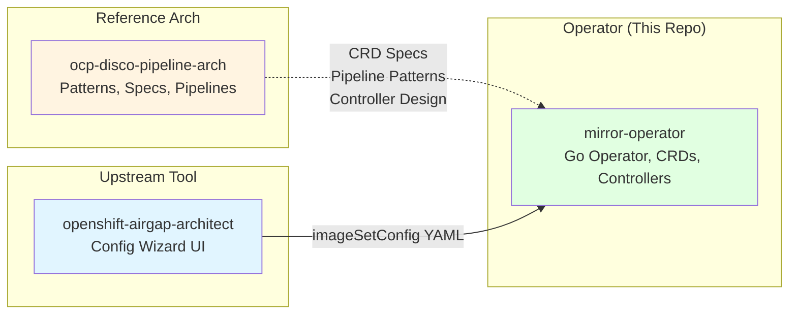
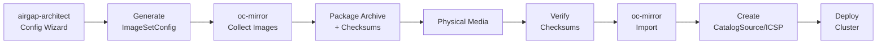
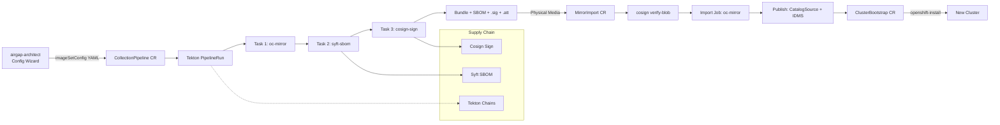

# Reference Architecture Mapping

This document maps the [OCP Disconnected Pipeline Reference Architecture](https://github.com/mathianasj/ocp-disco-pipeline-arch) to the `mirror-operator` implementation. It explains how each concept, component, and pattern from the reference architecture is realized in this operator.

---

## Three-Repository Pattern

The reference architecture defines a [three-repository pattern](https://github.com/mathianasj/ocp-disco-pipeline-arch/blob/master/docs/reference-architecture-pattern.md#the-three-repository-pattern):

| Role | Reference Spec | Implementation |
|---|---|---|
| **Reference Architecture** | `ocp-disco-pipeline-arch` | Patterns, examples, and documentation (unchanged) |
| **Production Operator** | `disconnected-platform-operator` (placeholder name) | **`mirror-operator`** (this repo) — production Go operator with CRDs, controllers, OLM bundle |
| **Enhanced Upstream Tool** | `openshift-airgap-architect` | Config wizard that generates ImageSetConfiguration YAML; consumed as raw YAML field in CRs |

### Mapping Detail

---

## CRD Mapping

### API Group & Version

| Aspect | Reference Spec | Implementation |
|---|---|---|
| API group | `disconnected.openshift.io` | `mirror.mirror.mathianasj.github.com` |
| Version | `v1alpha1` | `v1` |
| Scope | Cluster-scoped (`DisconnectedPlatform`), Namespaced (others) | Same |

### DisconnectedPlatform

The top-level orchestrator CRD. Maps directly from the reference spec with additions for OLM subscription management.

| Field | Reference Spec | Implementation | Notes |
|---|---|---|---|
| `mode` | `connected` / `airgapped` | Same (`PlatformMode`) | Identical enum |
| `connected.collectionSchedule` | Cron string | Same | Identical |
| `connected.mirrorRegistry` | Registry URL | Same | Identical |
| `connected.artifactStorage` | `{storageClass, size}` | Same (no `accessMode`) | Simplified |
| `connected.triggerTypes` | `[scheduled, manual, event]` | Same (`TriggerType` slice) | Identical |
| `connected.operators` | Not in spec | **Added**: `OperatorConfig` with `openshiftPipelines`, `rhtas`, `rhtpa` | OLM subscription lifecycle |
| `airgapped.managementCluster` | Bool | Same | Identical |
| `airgapped.mirrorRegistry` | Registry URL | Same | Identical |
| `airgapped.bootstrapEnabled` | Bool | Same | Identical |
| `airgapped.importPath` | File path | Same | Identical |
| `airgapped.registryCredentials` | Secret reference | Same (`LocalObjectReference`) | Identical |
| `airgapArchitect` (ref: `airgapArchitect`) | `{enabled, resources, route}` | `architect` with `{enabled}` only | Simplified |
| `gitOps` | `{enabled, repositoryURL, branch, path, credentials}` | Stub (`GitOpsConfig`) | Not yet implemented |
| `status.phase` | `Ready / Collecting / Importing / Error / Unknown` | `Ready / Collecting / Importing / Error` | No `Unknown` |
| `status.lastCollection` / `lastImport` | `{version, timestamp, size, status}` | `{version, timestamp}` + `collectionHistory[]` / `importHistory[]` | Extended with full history arrays |

**Reference:** [API Spec: DisconnectedPlatform](https://github.com/mathianasj/ocp-disco-pipeline-arch/blob/master/docs/operator-specs/api-specifications.md#1-disconnectedplatform)  
**Implementation:** `api/v1/disconnectedplatform_types.go`

### CollectionPipeline

Maps the reference's collection pipeline CRD. Key differences: we embed ImageSetConfig as raw string (not ConfigMapRef), and we've added supply chain security fields.

| Field | Reference Spec | Implementation | Notes |
|---|---|---|---|
| `imageSetConfig` | `ConfigMapReference{name, key}` | Raw YAML string (`string`) | Accepts inline YAML from airgap-architect |
| `triggerType` | `TriggerType` enum | Same | Identical |
| `incremental` | Bool | Same | Identical |
| `baseVersion` | String | Same | Identical |
| `storage` | `{mirrorWorkspace PVC, packageStorage PVC}` | `ArtifactOutput{output BundleOutput{pvc, filename, s3}}` | Single PVC with optional S3 |
| `signing` | Not in spec | **Added**: `CosignSigningConfig{keySecretRef, passwordSecretRef}` | Cosign key/password for tarball signing |
| `status.phase` | `Pending / Collecting / Packaging / Complete / Failed` | `Pending / Collecting / Complete / Failed` | No `Packaging` phase |
| `status.pipelineRun` | String ref | `pipelineRunRef` | Same pattern |
| `status.sbomRef` | Not in spec | **Added**: ConfigMap reference for generated SBOM | Supplier chain security |
| `status.sbomReaderRef` | Not in spec | **Added**: Job reference for SBOM extraction | Reader Job reads pod logs |

**Reference:** [API Spec: CollectionPipeline](https://github.com/mathianasj/ocp-disco-pipeline-arch/blob/master/docs/operator-specs/api-specifications.md#3-collectionpipeline)  
**Implementation:** `api/v1/collectionpipeline_types.go`

### ClusterBootstrap

Maps directly from the reference spec. Currently a stub with matching status phases.

| Field | Reference Spec | Implementation | Notes |
|---|---|---|---|
| `version` | String | Same | Identical |
| `platform` | Enum: `vsphere, baremetal, aws-govcloud, azure-gov, nutanix` | `string` | Same enum, not yet validated |
| `installConfig` | `SecretReference{name, namespace}` | `{name}` (string referencing a resource) | Simplified |
| `mirrorRegistry` | String | Same | Identical |
| `pullSecret` | `SecretReference` | `{name}` | Simplified |
| `trustBundle` | `SecretReference` | `{name}` | Simplified |
| `network` | `{clusterNetwork, serviceNetwork, networkType}` | Same | Identical |
| `controlPlane` / `compute` | `NodePoolConfig{replicas, resources}` | Same | Identical |
| `postInstall` | `{operators[], configurations[]}` | Stub | Not yet implemented |
| `status.phase` | `Pending / Validating / Installing / Complete / Failed` | Same | Identical |

**Reference:** [API Spec: ClusterBootstrap](https://github.com/mathianasj/ocp-disco-pipeline-arch/blob/master/docs/operator-specs/api-specifications.md#2-clusterbootstrap)  
**Implementation:** `api/v1/clusterbootstrap_types.go`

### MirrorImport

**Not in the reference API specs.** This is a new CRD we designed to fill a gap identified during implementation. The reference architecture describes import as a manual script step; we made it a managed CRD.

| Field | Rationale |
|---|---|
| `imageSetConfig` | Same YAML used to build the bundle — needed for `oc-mirror --from` import |
| `bundle` | `{pvc, filename}` references the physical bundle artifact |
| `targetRegistry` | Airgapped Quay instance to import into |
| `publish` | Controls CatalogSource + IDMS creation after import |
| `collectionVersion` | Links back to the CollectionPipeline version for history tracking |
| `verify` | **Added**: Cosign verification + Enterprise Contract policy check |

**Implementation:** `api/v1/mirrorimport_types.go`

### MirrorRelease (Deprecated)

Present in the reference architecture's pipeline examples. Kept for backward compatibility but has **no active controller**. Use `CollectionPipeline` instead.

**Implementation:** `api/v1/mirrorrelease_types.go`

---

## Supply Chain Security (Beyond Reference Arch)

The reference architecture describes basic checksumming (`CHECKSUMS.sha256`). This operator adds **full RHTAP supply chain security**:

| Security Control | Reference Arch | Implementation |
|---|---|---|
| Artifact integrity | SHA256 checksums | SHA256 checksums (baseline) |
| Image SBOM | Not specified | **Syft** CycloneDX JSON per collection |
| Bundle signing | Not specified | **Cosign** sign-blob (.sig + .att) |
| Signature verification | Not specified | **Cosign** verify-blob before import |
| Attestation policy | Not specified | **Enterprise Contract** (stub — `ec` CLI TBD) |
| Pipeline attestation | Not specified | **Tekton Chains** SLSA level 3 |

### CollectionPipeline PipelineRun Tasks (vs Reference)

| Reference Step | Implementation Task | Image |
|---|---|---|
| `oc-mirror` collection | **Task 1 — oc-mirror**: `oc-mirror --config ... file:///workspace/output --v2` | Tooling image |
| Checksum generation | Replaced by **Task 2 — syft-sbom**: `syft dir:... -o cyclonedx-json` | Tooling image |
| Archive packaging | **Task 3 — cosign-sign**: `cosign sign-blob` creates .sig + .att | Tooling image |
| Not in reference | **SBOM reader Job**: post-PipelineRun reads SBOM from pod logs → ConfigMap | Tooling image |

### MirrorImport Job Steps (vs Reference)

| Reference Step | Implementation Step | Image |
|---|---|---|
| `sha256sum -c CHECKSUMS.sha256` | **Cosign verify-blob** (optional, when `verify.publicKeySecretRef` set) | Tooling image |
| `tar -xzf archive.tar.gz` | `tar -xvf /data/<bundle> -C /workspace` | Tooling image |
| `oc-mirror --from` | `oc-mirror --config ... --from file:///workspace docker://<registry> --v2` | Tooling image |
| Manual CatalogSource creation | **ensureCatalogSource()** — creates CatalogSource in openshift-marketplace | Controller |
| Manual ICSP creation | **ensureICSP()** — creates ImageDigestMirrorSet | Controller |

---

## Pipeline Topology: Reference vs Operator

### Reference Architecture (Tekton Pipeline)

### Operator Implementation

---

## Operator-Managed Components (OLM Subscriptions)

The reference architecture's [future vision](https://github.com/mathianasj/ocp-disco-pipeline-arch/blob/master/docs/future-vision-operator-integration.md#3-operator-managed-pipeline-components) describes operators managing their own dependencies. We implement this via `spec.connected.operators`:

| Component | Reference Arch | Implementation |
|---|---|---|
| Tekton Pipelines | Manual install or OLM | Managed via `DisconnectedPlatform.spec.connected.operators.openshiftPipelines` |
| RHTAS (Cosign) | Manual install | Managed via `...operators.rhtas` (disabled by default) |
| RHTPA (Syft) | Manual install | Managed via `...operators.rhtpa` (disabled by default) |

Each operator config supports: `disabled`, `channel`, `approvalStrategy`, `catalogSource`, `catalogSourceNamespace`, `startingCSV`.

---

## Deviations from Reference Spec

| Reference Spec Decision | Operator Decision | Rationale |
|---|---|---|
| `imageSetConfig` as ConfigMapRef | Raw YAML string inline | Airgap-architect generates YAML; avoids extra ConfigMap creation step for simple cases |
| `storage` with two PVCs (`mirrorWorkspace` + `packageStorage`) | Single PVC with optional S3 | Simplified storage model; single workspace for oc-mirror output |
| Separate `Packaging` phase | No `Packaging` phase | oc-mirror produces output directly; packaging is implicit in the output PVC |
| `CollectionStatistics` in status | Not implemented | Not yet needed; could be added for UI display |
| `AirgapArchitectConfig` with route/TLS/resources | Simple `{enabled}` only | Route management deferred until airgap-architect integration |
| `GitOpsConfig` with full ArgoCD integration | Stub | Deferred for future phase |
| Import as manual script | `MirrorImport` CRD | Full lifecycle management, version tracking, and state machine |
| API group `disconnected.openshift.io` | `mirror.mirror.mathianasj.github.com` | Custom domain; aligns with existing naming |
| Version `v1alpha1` | `v1` | Production-grade from start; breaking changes managed via field deprecation |

---

## Image Strategy

| Image | Reference Arch | Implementation |
|---|---|---|
| Controller | Not specified (operator pattern) | `Dockerfile` — multi-stage Go build on `golang:1.24` → `ubi9-minimal` |
| Tooling | Separate `oc` + `oc-mirror` binaries | `Dockerfile.tooling` — single image with `oc-mirror 4.21.0`, `cosign v2.4.3`, `syft v1.21.0`, `oc 4.21.17`, `kubectl` |
| Reference | Required to include `openshift-install` + `helm` in image | Not yet included (ClusterBootstrap is a stub) |

---

## Status: Implementation Coverage

| Reference Component | Status | File(s) |
|---|---|---|
| DisconnectedPlatform CRD + Controller | ✅ Complete | `api/v1/disconnectedplatform_types.go`, `internal/controller/disconnectedplatform_controller.go` |
| CollectionPipeline CRD + Controller | ✅ Complete | `api/v1/collectionpipeline_types.go`, `internal/controller/collectionpipeline_controller.go` |
| MirrorImport CRD + Controller | ✅ Complete (new, not in ref) | `api/v1/mirrorimport_types.go`, `internal/controller/mirrorimport_controller.go` |
| ClusterBootstrap CRD + Controller | 🔄 Stub | `api/v1/clusterbootstrap_types.go`, `internal/controller/clusterbootstrap_controller.go` |
| Supply chain (SBOM) | ✅ Complete (Syft task) | `internal/controller/collectionpipeline_controller.go` |
| Supply chain (Signing) | ✅ Complete (Cosign task) | `internal/controller/collectionpipeline_controller.go` |
| Supply chain (Verification) | ✅ Complete (Cosign verify-blob) | `internal/controller/mirrorimport_controller.go` |
| Supply chain (EC policy) | 📋 Stub (`ec` CLI not bundled) | `api/v1/mirrorimport_types.go` (field exists) |
| OLM Subscription management | ✅ Complete | `internal/controller/disconnectedplatform_controller.go` |
| Airgap-architect UI deployment | 📋 Not implemented | `api/v1/disconnectedplatform_types.go` (field exists) |
| GitOps integration | 📋 Stub | `api/v1/disconnectedplatform_types.go` (field exists) |
| ClusterBootstrap openshift-install | 📋 Not implemented | Stub phase machine only |
| S3 import path | 📋 Not implemented | `api/v1/collectionpipeline_types.go` (field exists) |
| Incremental build number | 📋 Not implemented | Build number hardcoded to `001` |
| OLM bundle generation | ✅ Complete | `make bundle` → `./bundle/` |
| Tests | ✅ 61 tests, 64.3% coverage | `internal/controller/*_test.go` |

---

## Quick Reference: File Mapping

| Reference Architecture Concept | Implementation Location |
|---|---|
| CRD specs | `api/v1/` |
| Controller logic | `internal/controller/` |
| Pipeline/Job resources | `internal/controller/collectionpipeline_controller.go` (PipelineRun), `internal/controller/mirrorimport_controller.go` (Job) |
| Tooling Dockerfile | `Dockerfile.tooling` |
| Controller Dockerfile | `Dockerfile` |
| OLM bundle | Generated by `make bundle` → `./bundle/` |
| Sample CRs | `config/samples/` |
| RBAC | `config/rbac/role.yaml` |
| Operator deployment | `config/manager/manager.yaml` |
| Airgap-architect wizard | External: [openshift-airgap-architect](https://github.com/bstrauss84/openshift-airgap-architect/) |
| Reference architecture | External: [ocp-disco-pipeline-arch](https://github.com/mathianasj/ocp-disco-pipeline-arch) |

---

## Cross-References

- [Reference Architecture Pattern](https://github.com/mathianasj/ocp-disco-pipeline-arch/blob/master/docs/reference-architecture-pattern.md)
- [API Specifications](https://github.com/mathianasj/ocp-disco-pipeline-arch/blob/master/docs/operator-specs/api-specifications.md)
- [Future Vision: Operator Integration](https://github.com/mathianasj/ocp-disco-pipeline-arch/blob/master/docs/future-vision-operator-integration.md)
- [Operator Specs Index](https://github.com/mathianasj/ocp-disco-pipeline-arch/blob/master/docs/operator-specs/README.md)
- [AGENTS.md](../AGENTS.md) — Full operator context and implementation status
